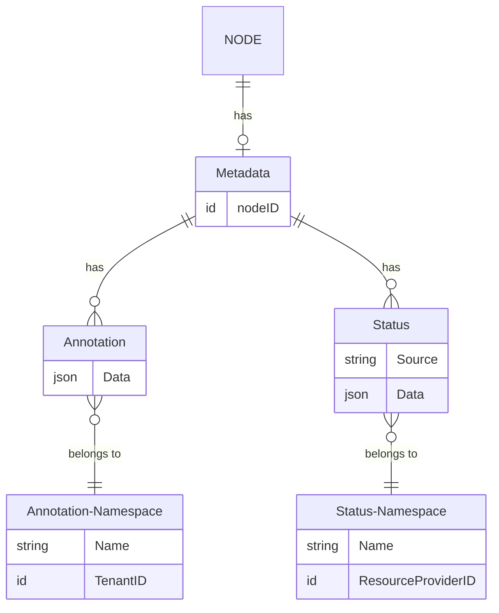

# Metadata API

Metadata API implements a GraphQL API that provides a way to manage and control metadata for all resources in the Graph using GraphQL queries and mutations.

## Metadata structure

_ID fields between objects are not shown_

### Metadata

Metadata is a top level structure that provides the connection to all metadata types for a `Node`. Any Graph `Node` that impliments the `Metadataable` interface can have metadata on it.

### Annotation Namespaces

Annotation Namespaces provide the ability to create a namespace that annotations can be stored in. A namespace is meant to store only one type of data. For example if you wanted to store custom data about the version of your OS on every instance you could create a namespace called `os-info`. We recommend that you use the format of `domain-name/name`, so for OS info it would be `nicole.dev/os-info` for example. This isn't required but will prevent conflicts between services that use namespaces storing the same key of data. An annotation namespace is scoped to a tenant and can be set as private. When a namespace is marked private, you can only view data in this namespace if you have permissions to view private namespaces on the tenant the namespace belongs to.

### Annotations

Annotations store the actually data for a node. The data stored on an annotation is a JSON field that accepts any valid JSON. So continuing the previous example, for our os info namespace we might store data that looks like `{"os": "Ubuntu 22.04", "family": "Ubuntu", "kernel": {"version": "5.10", "family": "Linux"}}`. The field supports any level of nesting of the data that the user wishes to perform.

### Status Namespaces

Status Namespaces are similar to Annotation Namespaces except they belong to a `Resource Provider` instead of a `Tenant`. This allows us to limit which status fields a resource provider can update.

### Statuses

Statuses store data the same way that Annotations do. Becuase a status field may need to be reported from multiple sources we provide a source field to allow the same namespace to be used for statuses. An example of where this would be important is for a `LoadBalancer` you may have it running in multiple locations. As such you will want to report each location with it's own status and be able to track those independently.

## Development and Contributing

- [Development Guide](docs/development.md)
- [Contributing](https://infratographer.com/community/contributing/)

## Code of Conduct

[Contributor Code of Conduct](https://infratographer.com/community/code-of-conduct/). By participating in this project you agree to abide by its terms.

## Contact

To contact the maintainers, please open a [GithHub Issue](https://github.com/infratographer/metadata-api/issues/new)

## License

[Apache 2.0](LICENSE)
